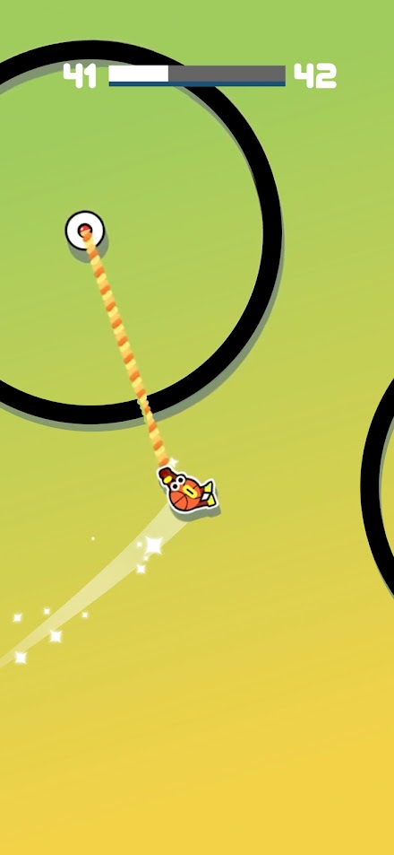
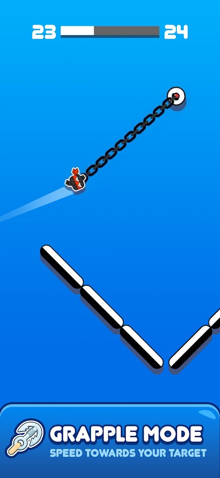
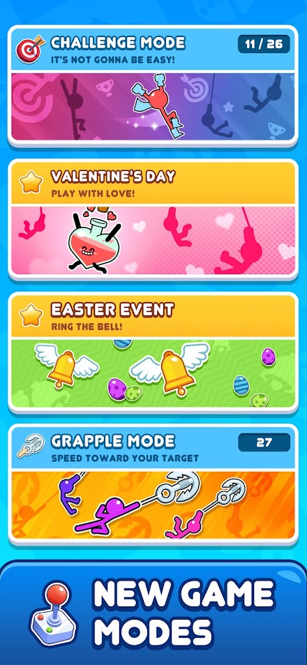
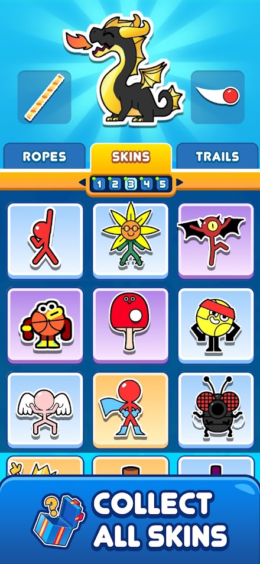
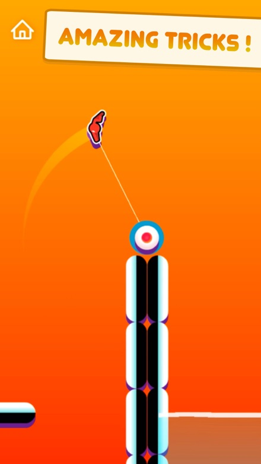
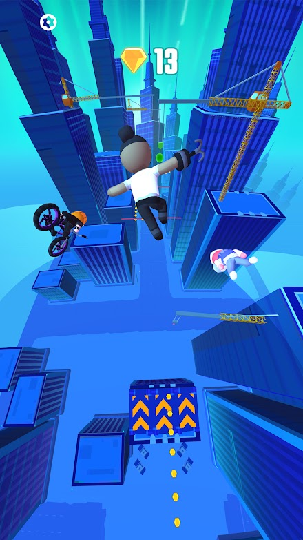
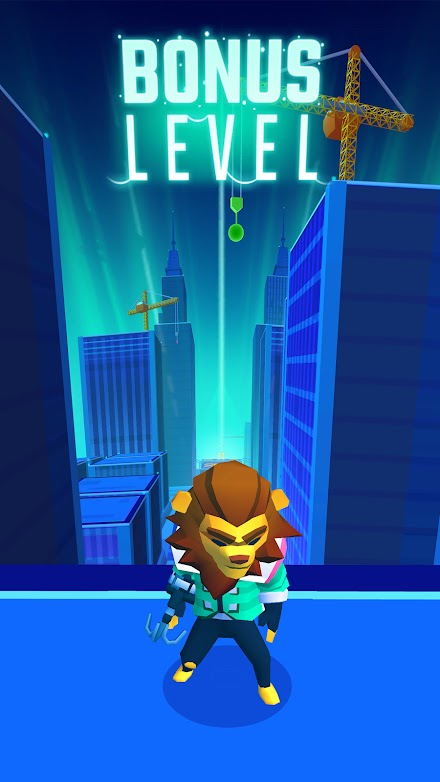
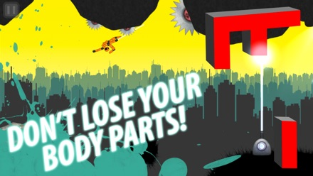
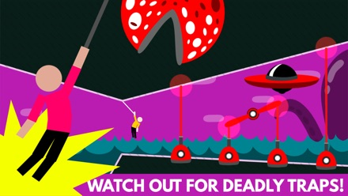
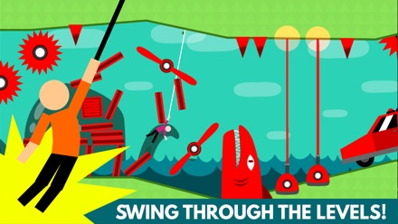

# Конкуренти: детальний розбір механік

**Дата:** 2026-08-31
**Доповнює:** `competitors-and-differentiation.md` (стратегічний зріз) — цей файл про те, **як саме влаштовані** ігри конкурентів
**Позначки:** ✅ перевірено · ⚠️ спірно · ❌ спростовано · 🔬 треба виміряти · 📋 припущення

---

## 0. Метод

**Що зроблено цього разу:**

1. **Офіційний App Store Lookup API** (`itunes.apple.com/lookup`) — точні версії, дати релізу й останнього оновлення, кількість оцінок, розмір інсталяції, прапорець Game Center. Це первинне джерело Apple, а не переказ.
2. **Сторінки Google Play** — витягнуто галереї скріншотів.
3. **Скріншоти переглянуто напряму.** Я не переказую опис зі стору — я дивився на кадри й описую те, що на них видно. Кожен скріншот лежить у `assets/shots/` і показаний нижче.
4. **Ігрові описи й гайди** — для тверджень про керування, які зі скріншота не видно.

**Чого я НЕ зробив і що це означає:** я не грав. Тому все, що вимагає секундоміра чи відчуття в руках, лишається 🔬: середня довжина рану, час від смерті до рестарту, точна геометрія автопідбору анкера, реальна частота реклами. Бланк для цих замірів — у `competitors-and-differentiation.md`, розділ 11. Твердження про керування нижче взяті з ігрових гайдів і позначені як такі, а не видані за власне спостереження.

**Про скріншоти:** це матеріали зі сторінок публікації в App Store і Google Play, використані для внутрішнього конкурентного аналізу з посиланням на джерело. Права належать відповідним розробникам.

---

## 1. Перевірені метадані — з офіційного API Apple

Дані отримані 2026-08-31 через `itunes.apple.com/lookup`. ✅

| Гра | Розробник | Реліз | Останнє оновлення | Версія | Оцінок | Бал | Розмір iOS |
|---|---|---|---|---|---|---|---|
| **Stickman Hook** | MADBOX | 03.10.2018 | **12.08.2026** | 9.9.51 | **1 025 293** | 4.70 | **545 МБ** |
| **Stickman Hook 2** | MADBOX | 31.01.2020 | **31.01.2020** | **1.0** | 331 | 3.55 | 126 МБ |
| **Hanger — Rope Swing** | A Small Game AB | 07.07.2012 | 22.11.2018 | 2.13 | 375 | 4.16 | 106 МБ |
| **Hanger World** | A Small Game AB | 29.07.2015 | 28.11.2018 | 1.33 | 97 | 4.43 | 92 МБ |
| **Hang Line: Mountain Climber** | Yodo1 | 16.01.2019 | 15.04.2026 | 1.9.39 | 17 975 | 4.58 | 714 МБ |

**Дві знахідки, які змінюють картину:**

### ❌ Виправлення: Stickman Hook 2 покинута, а не «активна»

У попередньому документі я записав її як активну. **Це неправда.** `currentVersionReleaseDate` дорівнює `releaseDate`: версія **1.0 від 31.01.2020, жодного оновлення за шість із половиною років**. Джерела, які описують її як живу, переказують сторінку стору, а не дані API.

Це підсилює висновок, а не послаблює: Madbox зробив сиквел із більшим обсягом контенту (вода, бустери, ендлес-режим, чекпоінти, 23 скіни), отримав **331 оцінку проти мільйона** і **кинув його**, продовживши вкладатися в оригінал. Контент справді не рів — це підтверджено поведінкою самої студії, а не лише цифрою оцінок.

### ✅ Франшиза Hanger заморожена з 2018

Обидві гри A Small Game востаннє оновлювалися в листопаді 2018. Решта або мертві, або в іншій ніші.

### ➕ Доповнення від 31.08.2026 — три гри, знайдені дорісерчем

Детальний розбір — у `differentiation-research.md`, розділ 0. Коротко:

| Гра | Що це міняє | Дата ✅ |
|---|---|---|
| **[Grapple Hook Hero: Zip Action](https://apps.apple.com/us/app/grapple-hook-hero-zip-action/id6748051758)** (KAYAC Inc.) | **Друга жива гра жанру.** 1 861 оцінка, 4.61, оновлена 14.04.2026. Тап кидає гак, утримання притягує. Має **фотозйомку з наліпками й цитатами** — тобто вбудований артефакт для шерингу | реліз 07.07.2025 |
| **[Super QuickHook](https://en.wikipedia.org/wiki/Super_QuickHook)** (Rocketcat Games) | ❗ **Мала асинхронну привид-гонку з друзями** через OpenFeint, дуелі, опубліковані привиди розробників, медалі за рівень і **ручне прицілювання** гака. Це б'є прямо в нашу гіпотезу про унікальність привида | iOS 17.06.2010 |
| **[Swing Trials](https://apps.apple.com/us/app/swing-trials/id6478132861)** (Renan Ferreira) | Мікроінді, 0 оцінок, оновлена 17.06.2026 | реліз 29.05.2024 |

**Виправлення до висновку вище:** живих ігор жанру **дві**, а не одна — Stickman Hook і Grapple Hook Hero. І твердження «жоден конкурент не мав привида друга» ❌ **спростовано** Super QuickHook'ом; чинним лишається вужче — привид як **фізичний об'єкт** прецеденту не має.

---

## 2. Stickman Hook (Madbox) — розбір лідера

### 2.1 Що видно на кадрі

Спостереження зі скріншота ✅:

- **Орієнтація — портретна.** Це важливо: я раніше припустив ландшафт із пропорцій прев'ю і помилився. Портрет означає, що кадр нативно підходить під вертикальне відео, і перевага «ми вертикальні, а вони ні» **не існує**.
- **Анкери — явні білі кола з червоною точкою.** Це не абстрактні точки простору: гравець бачить ціль заздалегідь і читає траєкторію наперед.
- **Трос намальований смугастою «мотузкою»** — тобто трос є частиною візуальної ідентичності, а не тонкою лінією.
- **Перешкоди — чорні кільця**, крізь які треба пролетіти. Тобто перешкода не лише вбиває, а й **задає форму траєкторії**.
- **Слід за героєм** — світлий шлейф із іскрами. Джус зроблений кодом, як і планується в нас.
- **Угорі — індикатор «41 ▮▮▯▯ 42»**: номер поточного рівня, прогрес-бар і номер наступного. Прогресія лінійна й весь час на очах.
- Герой — не стікмен, а скін (баскетбольний м'яч у кедах).

### 2.2 Керування

За ігровими гайдами ⚠️ (не власне спостереження): утримання пальця випускає трос **до найближчої точки кріплення автоматично**, герой іде по дузі; відпускання зберігає поточну швидкість і напрямок. Тобто гравець керує **лише таймінгом**, а вибір анкера робить гра. Бампери-відбивачі підштовхують героя, поки він тримається за трос.

**Що це означає для нас:** автопідбір анкера — не наша ідея й не наша перевага, це галузевий стандарт цього жанру. Простір для диференціації в керуванні є рівно один — **віддати вибір анкера гравцеві** (див. `differentiation-ideas.md`, ідея 12).

### 2.3 Другий дієслівний режим — Grapple Mode

Окремий режим, у якому трос — це ланцюг, а гравця **притягує до цілі**, замість маятника. Підпис: «SPEED TOWARDS YOUR TARGET». 27 рівнів. Перешкоди тут інші — сегментовані біло-чорні жердини.

**Наслідок:** ідея «додати другий тип гака — притягування замість дуги» **вже реалізована лідером**. Її не можна брати як диференціацію.

### 2.4 Жива операційна діяльність

На екрані режимів видно ✅:

- **Challenge Mode** з лічильником 11/26;
- **сезонні події** — «Valentine's Day», «Easter Event»;
- **Grapple Mode** з лічильником 27.

Тобто Madbox тримає **лайв-опс**: тематичні події з власними наборами рівнів. Плюс чейнджлог v9.9.51 від 05.08.2026 додає **Adventure Mode зі змаганням проти 1500+ гравців** ⚠️ (за чейнджлогом APKPure).

**Це найнеприємніша знахідка розділу.** Ми конкуруємо не з грою 2018 року, а з живою студією, яка щомісяця випускає контент і у 2026 сама рухається в бік змагальності.

### 2.5 Косметика — три слоти

Вкладки **ROPES / SKINS / TRAILS**, п'ять сторінок скінів. Тобто продається не «скін персонажа», а **три незалежні слоти**: вигляд троса, персонаж, слід. Це втричі збільшує кількість товарних позицій без нового геймплею.

**Що беремо:** модель трьох слотів дешева й перевірена. Наш трос усе одно `Graphics.lineTo` — перефарбувати його коштує нуль.

### 2.6 Монетизація й тиск ✅

| Позиція | Ціна |
|---|---|
| No Ads | $2.99 і $3.99 |
| Welcome Offer | $3.99 |
| VIP Bundle | $7.99 і $11.99 |
| Coins Pack 1 / 2 / 3 | $0.99 / $1.99 / $8.99 |
| Skip Tickets Pack 1 / 3 | $1.99 / $5.99 |

«Skip Tickets» — квитки на пропуск рівня. Тобто монетизується **фрустрація від складності**, а не лише косметика. Плюс продаж відсутності реклами двома цінами.

Скарги з відгуків ✅: *«ads appear EVERY time you begin and finish level (or die)»* і *«it's the same 5 things over and over again»*.

### 2.7 Вразливості лідера — підсумок

| Вразливість | Число | Наша позиція |
|---|---|---|
| Вага інсталяції | **545 МБ** iOS / **802.7 МБ** APK | ≤ 3 МБ, без установки |
| Реклама після кожної події | скарги у відгуках | тільки rewarded, за вибором |
| Повторюваність | скарги у відгуках | траса з сіду, не список рівнів |
| Немає зв'язку між гравцями | Game Center лідерборд і турнір на 1500 незнайомців | дуель із конкретним другом у чаті |
| Прогресія лінійна, «рівень 41 з …» | видно на кадрі | ендлес + щоденний сід |

---

## 3. Stickman Hook 2 — покинутий сиквел

На кадрі ✅: портрет, анкер — мішень-«яблучко» на вершині смугастої колони, трос тонкий (на відміну від смугастого в першій частині), видно **дугу-траєкторію**, підпис «AMAZING TRICKS!». Арт помітно чистіший і мінімалістичніший за оригінал.

І при цьому: **v1.0, 31.01.2020, 331 оцінка, 3.55**. Краща графіка й більше контенту не врятували.

**Урок для нас, прямий:** у цій ніші перемога не дається ні артом, ні обсягом. Обидва важелі вже спробувані студією, яка виграла нішу, і обидва не спрацювали.

---

## 4. Swing Loops: Grapple Hook Race (SayGames) — 10 млн+

Спостереження ✅:

- **Це не 2D-маятник.** Це **3D-раннер від третьої особи** в лоу-полі місті: камера ззаду, герой летить між хмарочосами.
- **У кадрі кілька персонажів одночасно** — велосипедист, ще одна фігура. Це або суперники в гонці, або декоративні NPC; за кадром відрізнити не можу 🔬.
- **Збір валюти** — лічильник кристалів угорі, ланцюжки монет на трасі задають бажану траєкторію.
- Трос тонкий, майже непомітний — акцент на швидкості й місті, а не на тросі.

Є **бонусні рівні** з окремою подачею.

**Висновок:** попри назву, це інший піджанр — 3D-паркур-раннер, ближчий до Subway Surfers із гаком, ніж до нас. Він конкурує за ту саму полицю в сторі й за слово «grapple hook» в ASO, але не за те саме відчуття. **У списку прямих конкурентів його треба тримати з поміткою «інший піджанр»**, і це трохи послаблює твердження про перенасиченість саме нашої ніші.

---

## 5. Endless Hook (GaconGame) — найближчий за формою, найменший за силою

Спостереження ✅:

- **Ландшафтна орієнтація** — на відміну від Stickman Hook.
- Гранично мінімальний плаский арт: кольорові квадрати з намальованими обличчями, чорний фон, трос — проста лінія.
- Меню: грати, персонаж, магазин, налаштування. Нічого більше.

Магазин — три скіни: екіпований, 500 монет, 1000 монет. **Тільки м'яка валюта, жодних реальних грошей на цьому екрані.** Гра офлайн, версія 0.5.1, 30.9 МБ.

**Чому це важливо:** це і є доказ, що механіка сама по собі нічого не варта. Гра з тією самою механікою, тим самим автопідбором анкера і мінімальним артом існує, оновлювалася в травні 2026 — і не має ні аудиторії, ні монетизації. **Наш прототип за замовчуванням виглядатиме саме так**, якщо ми не додамо нічого структурного.

---

## 6. Hanger і Hanger World (A Small Game) — інша фізика троса

Спостереження ✅:

- **Ландшафт, сайд-скрол.**
- Трос кріпиться **вгору, до стелі чи верхньої межі**, а не до дискретних анкерів попереду. Це принципово інша фізика: гравець постійно висить, а не перелітає від точки до точки.
- Персонаж — **ragdoll**, і в нього **відриваються кінцівки**. Підпис на кадрі: «DON'T LOSE YOUR BODY PARTS!».
- Рівні складені з великих червоних літер і геометричних блоків, силует міста на фоні — сильна графічна ідентичність при нулі деталізації.

Hanger World: та сама фізика, яскравіша палітра, багато типів пасток — шипи на стійках, пилки, літаюча тарілка, вода внизу.

**Механіка, яку варто вкрасти концептуально ⚠️** (за описами гри, не з кадру): рахунок залежить не лише від того, чи дійшов, а від того, **скількома тросами** ти пройшов і **наскільки цілим** лишився. Тобто в грі є вимір «елегантність проходження», а не тільки «дійшов / не дійшов».

**Hanger World має редактор рівнів із обміном кодами й лідербордами на відібраних рівнях** ✅ — це закриває для нас напрямок UGC як «нового».

---

## 7. Hang Line: Mountain Climber (Yodo1) — сусідня ніша

Гак у вертикальному сходженні: гравець кидає трос угору, підтягується, рятує застряглих. 17 975 оцінок, 4.58, активно оновлюється (15.04.2026). **714 МБ.**

Показова деталь: у грі є **мета-ціль поза рекордом** — рятувати персонажів. Це те, чого немає в жодного чистого свінгера: причина рухатися, крім числа.

---

## 8. Порівняльна таблиця механік

| | Stickman Hook | Stickman Hook 2 | Swing Loops | Endless Hook | Hanger / World | Наш план |
|---|---|---|---|---|---|---|
| Орієнтація | портрет | портрет | портрет | **ландшафт** | ландшафт | портрет 9:16 |
| Вимір | 2D | 2D | **3D** | 2D | 2D | 2D |
| Куди кріпиться трос | дискретні анкери попереду | те саме | точки в 3D-місті | найближча точка | **вгору, до стелі** | дискретні анкери |
| Вибір анкера | **авто** | авто | авто | авто | авто | 🔬 відкрите питання |
| Другий дієслівний режим | **є** (Grapple: притягування) | ні | ні | ні | ні | — |
| Структура траси | рівні, 100+ | рівні | рівні + бонусні | ендлес | рівні, 75+ | **сід + ендлес** |
| Смерть | миттєва | миттєва | миттєва | миттєва | **часткова — втрата кінцівок** | миттєва |
| Вимір майстерності | час і трюки | трюки | швидкість і збір | дистанція | **час + кількість тросів + цілість** | час і рахунок |
| Соціальне | Game Center, турнір 1500 | немає | немає | немає | **редактор + коди рівнів** | привид друга в чаті |
| Косметика | **3 слоти: трос / скін / слід** | 23 скіни | одяг, дошки, крила | 3 скіни | персонажі | 3 слоти |
| Лайв-опс | **сезонні події** | немає | ? | немає | немає | щоденний сід |
| Монетизація | IAP $0.99–11.99 + реклама | — | реклама + IAP | м'яка валюта | — | Stars + rewarded |
| Вага | **545 МБ / 802.7 МБ** | 126 МБ | — | 30.9 МБ | 106 МБ | **≤ 3 МБ** |
| Живий у 2026 | **так** | **ні, з 2020** | так | так | **ні, з 2018** | — |

---

## 9. Вісім висновків для нашого проєкту

1. **Живий конкурент один.** Stickman Hook. Hanger заморожений із 2018, Stickman Hook 2 — з 2020. Це краще, ніж «п'ять прямих аналогів», як було записано раніше, але гірше за структурою: єдиний живий конкурент — це студія з лайв-опсом і сотнею мільйонів завантажень.
2. **Портретна орієнтація не є перевагою.** Лідер уже портретний. Викреслюємо цей аргумент із виправдань.
3. **Автопідбір анкера — стандарт жанру, у всіх без винятку.** Отже, це або мовчазна згода з тим, що інакше незручно, або незайняте місце. Перевірити емпірично в тижні 1 — дешево.
4. **«Другий тип гака» вже зайнято** Grapple Mode. Не витрачати на це тижні.
5. **Вага — наш найсильніший вимірний аргумент.** 802.7 МБ проти 3 МБ і відкриття без установки. Це не риторика, це два числа.
6. **Смерть не зобов'язана бути миттєвою.** Hanger показує робочу альтернативу — деградація замість кінця. Це відкриває цілу гілку ідей.
7. **Вимір майстерності може бути не один.** У Hanger їх три: час, кількість тросів, цілість. У нас поки один — рахунок. Дешевий спосіб додати глибину без нового коду фізики.
8. **Причина рухатися, крім числа.** Hang Line рятує людей. Чистий свінгер цього не має, і це видно у скаргах на повторюваність у самого лідера.

---

## 10. Що виправити в попередніх документах

| Місце | Виправлення |
|---|---|
| `competitors-and-differentiation.md`, розділ 2.1 | Stickman Hook 2 — **не «Активна»**, а покинута: v1.0 від 31.01.2020, жодного оновлення |
| Те саме, рядок Hanger / Hanger World | Додати, що обидві заморожені з листопада 2018 |
| Те саме, рядок Swing Loops | Позначити як **інший піджанр** — 3D-раннер, а не 2D-маятник |
| `plan.md`, розділ 2.1 | «5+ прямих аналогів» уточнити: прямих і **живих** — один; решта мертві або в сусідньому піджанрі |
| Будь-яке місце, де портрет подавався як перевага | Викреслити — лідер портретний |

---

## 11. Джерела

**Первинні дані**
- [App Store Lookup API — Stickman Hook](https://itunes.apple.com/lookup?id=1435807944&country=us)
- [App Store Lookup API — Stickman Hook 2](https://itunes.apple.com/lookup?id=1491714120&country=us)
- [App Store Lookup API — Hanger](https://itunes.apple.com/lookup?id=529486638&country=us)
- [App Store Lookup API — Hanger World](https://itunes.apple.com/lookup?id=986709487&country=us)
- [App Store Lookup API — Hang Line](https://itunes.apple.com/lookup?id=1372005090&country=us)
- [Google Play — Stickman Hook](https://play.google.com/store/apps/details?id=com.mindy.grap1)
- [Google Play — Swing Loops](https://play.google.com/store/apps/details?id=com.parkour.swing)
- [Google Play — Endless Hook](https://play.google.com/store/apps/details?id=com.GaConDev.Hook)

**Сторінки й огляди**
- [Stickman Hook — App Store](https://apps.apple.com/us/app/stickman-hook/id1435807944)
- [Stickman Hook — APKPure, чейнджлог v9.9.51](https://apkpure.com/stickman-hook/com.mindy.grap1)
- [Stickman Hook — AppFollow, відгуки](https://apps.appfollow.io/ios/stickman-hook-racing-games/1435807944)
- [Stickman Hook — Poki](https://poki.com/en/g/stickman-hook)
- [Hanger — 148Apps, огляд](https://www.148apps.com/hanger-rope-swing-game/hanger-review/)
- [Players levels in Hanger World — блог A Small Game](https://www.asmallgame.com/blog/2016/6/20/players-levels-in-hanger-world-part-1)
- [Hang Line — App Store](https://apps.apple.com/us/app/hang-line-mountain-climber/id1372005090)
- [Swing Loops — опис і механіка](https://www.bluestacks.com/apps/racing/swing-loops-on-pc.html)
